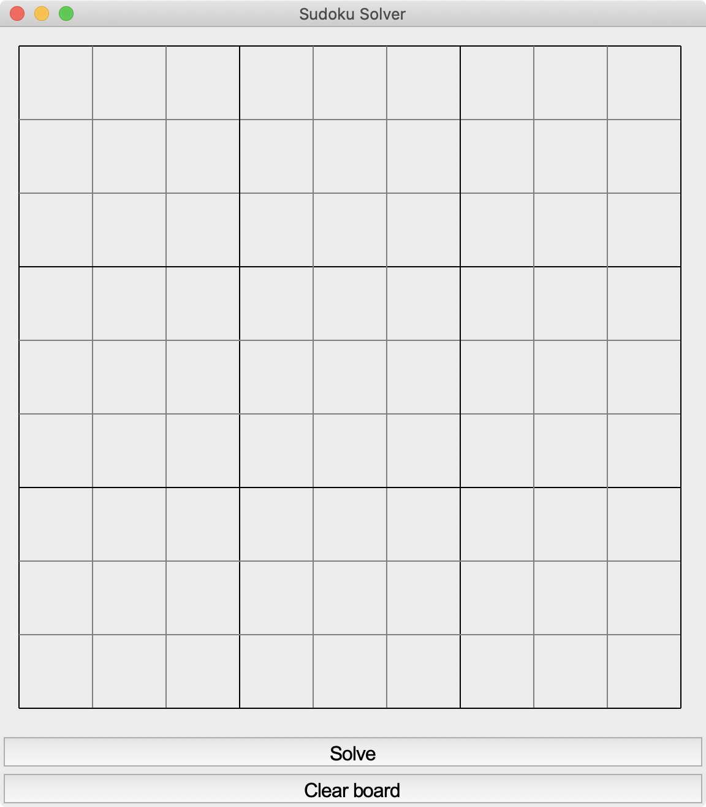

# Sudoku_Solver
Solves a user inputted sudoku board using a backtracking algorithm.

## About The Project

I have always enjoyed playing Sudoku and I've extended that interest to this program, which can help solve particularly thorny Sudoku boards. The user can simply enter a Sudoku board into the user interface, built using `Tkinter`, and a backtracking algorithm will solve the board in less than a tenth of a second. The user can then clear the board, and enter another Sudoku board if they wish. 

### Here's how the solver works:

This is the blank board that is loaded at the start of the program. The user can simply click into any cell into the board, and the selected cell will be highlighted with a green border. The user can then enter numbers into the board, using the arrow keys or WASD keys to navigate around the board.  

-->

Once the user has entered all the inputs and is ready to solve the board, click the "Solve" button at the bottom of the board. If the board is a valid Sudoku board, then a "Solved" message will appear on screen, otherwise, an error message will appear.

---

The user can click anywhere on the board to clear the pop-up messages, and the user can also click "Clear board" to clear the current board and enter a new board.

### Technical details

This project was built entirely in Python and the `Tkinter` library for the user interface.

In the future, I hope to:
* Add a "Show hint" feature so that users can get a clues on boards they are stuck on rather than getting full solutions 
* Deploy as a simple web or mobile app

#### Thanks for checking out my project! :wave: